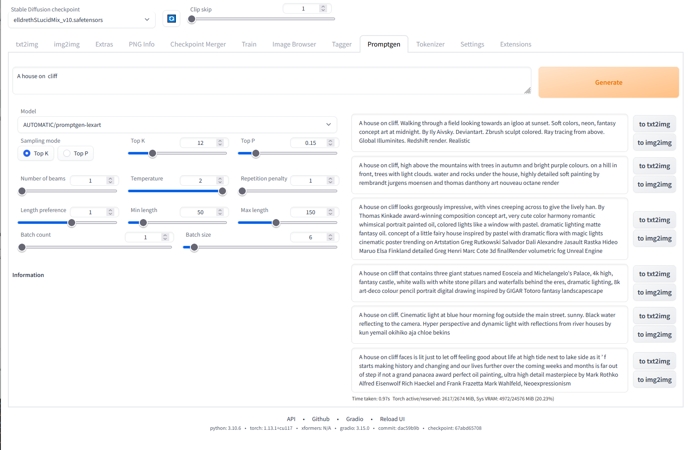

# Prompt generator
An extension for [webui](https://github.com/AUTOMATIC1111/stable-diffusion-webui) that lets you generate prompts.



## Getting more models online
You can add models from huggingface to the selection of models in setting. The setting field
is `Hugginface model names for promptgen, separated by comma`, and its default value is
just:
```
AUTOMATIC/promptgen-lexart, AUTOMATIC/promptgen-majinai-safe, AUTOMATIC/promptgen-majinai-unsafe
```
Those are GPT2 finetunes I did on various datasets:

- [AUTOMATIC/promptgen-lexart](https://huggingface.co/AUTOMATIC/promptgen-lexart): Finetuned distilgpt2 for 100 epochs on prompts scraped from lexica.art
- [AUTOMATIC/promptgen-majinai-safe](https://huggingface.co/AUTOMATIC/promptgen-majinai-safe): Finetuned distilgpt2 for 40 epochs on safe prompts scraped from majinai.art.
- [AUTOMATIC/promptgen-majinai-unsafe](https://huggingface.co/AUTOMATIC/promptgen-majinai-unsafe): Finetuned distilgpt2 for 40 epochs on unsafe prompts scraped from majinai.art.

To add more models, add more items to the setting, for example like this:

```
AUTOMATIC/promptgen-lexart, AUTOMATIC/promptgen-majinai-safe, AUTOMATIC/promptgen-majinai-unsafe, succinctly/text2image-prompt-generator, microsoft/Promptist
```

Reloading UI is required to apply this setting.

## Getting more models offline
Put your models into the `models` directory inside the extension. For example, my model can be
made fully offline by placing fines from https://huggingface.co/AUTOMATIC/promptgen-lexart/tree/main into
those directories:

```

 📁 webui root directory
 ┗━━ 📁 extensions
     ┗━━ 📁 stable-diffusion-webui-promptgen
         ┗━━ 📁 models                            
             ┗━━ 📁 promptgen-lexart              <----- any name can be used
                 ┣━━ 📄 config.json               <----- each model has its own set of required files;
                 ┣━━ 📄 merges.txt                       mine requires all those
                 ┣━━ 📄 pytorch_model.bin
                 ┣━━ 📄 tokenizer_config.json
                 ┗━━ 📄 vocab.json
```

Reloading UI is required to see new models.
